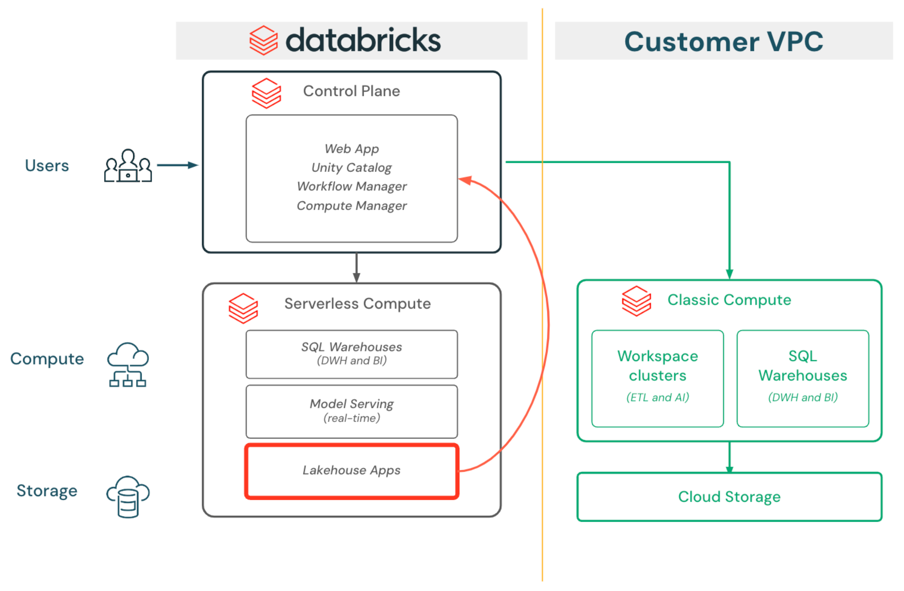

# 👾⛨•Lakehouse App powered by Unity Catalog masked data.

> [!IMPORTANT]  
> As Lakehouse Apps is still in private preview and the product has some preview limitations, this demo is *only* meant to be run in Databricks' E2-Dogfood Workspace. (As the product matures and get's shipped to Public Preview, the demo will be upgraded for use in any workspace. Also this demo is currently meant to be demoed by the Databricks field only). 

In this demo, we will learn how to harness the power of Unity Catalog to secure your data at a granular level using its **row-level** access control capabilities and consume the data from a **Databricks Lakehouse App**.

## Row level access control 

Row-level security allows you to automatically hide a subset of your rows based on who is attempting to query it, without having to maintain any seperate copies of your data.

A typical use-case would be to filter out rows based on your country or Business Unit : you only see the data (financial transactions, orders, customer information...) pertaining to your region, thus preventing you from having access to the entire dataset.

💡 While this filter can be applied at the user / principal level, it is recommended to implement access policies using groups instead.
 

## Lakehouse Apps

Lakehouse Apps are the fastest way to build and run apps that leverage your data, with the full security and governance of Databricks. Some of the features of Lakehouse Apps are as follows:
  1. Simple authoring in the workspace
  2. One-click deployment to built-in compute
  3. Integrated security and governance
  4. Built-in monitoring and observability
  5. Support for common open source frameworks
  6. Every app gets an automatically managed service principal
  7. Every user is automatically authenticated with OIDC/OAuth2 and SSO
  8. Specify which users can access your app
  9. Integrated with Unity Catalog 
  10. Use any Databricks workspace API

## Usage
To setup this demo for showcasing to a customer please follow the steps:
1. Clone this repo in Databricks E2-Dogfood Workspace.
2. Use the notebook serverless ⚡️ compute for speedy setup.
3. Open the `configs` notebook and run it to check if all demo configs are looking good. (Optionally, change the warehouse id in the notebook if required.)
4. Execute the `01. prepare data and apply row mask` notebook first. This will prepare the necessary unity catalog dataset and apply the row mask.
5. Next execute the `02. setup lakehouse app codebase` notebook. This will create the lakehouse app's necessary files in a newly created directory `lha_with_uc_app` in the current working directory.
6. Finally, if you want execute the `03. deploy the lakehouse app` notebook to _**programmatically**_ deploy the newly created lakehouse app and get it live.   Alternatively, you can follow the _**UI driven path**_ to deploy also, where you will go to `Compute` > `Apps` > `Create app`.
7. Check if the app is up and running or not. Once it's ready open the app link to use it. 

## Project Support

Please note that this demo assets is provided for a quick demo only, and are not formally supported by Databricks with Service Level Agreements (SLAs). They are provided AS-IS and we do not make any guarantees of any kind. Please do not submit a support ticket relating to any issues arising from the use of these demo artifacts.

Any issues discovered through the use of this demo should be filed as GitHub Issues on the Repo.  They will be reviewed as time permits, but there are no formal SLAs for support.

## Feedback, Queries or Improvement ideas...

Reach out to [Databricks](https://www.databricks.com/) field engineers: 
* [Souvik Pratiher](mailto:souvik.pratiher@databricks.com) 
* [Purvang Parikh](mailto:purvang.parikh@databricks.com)

